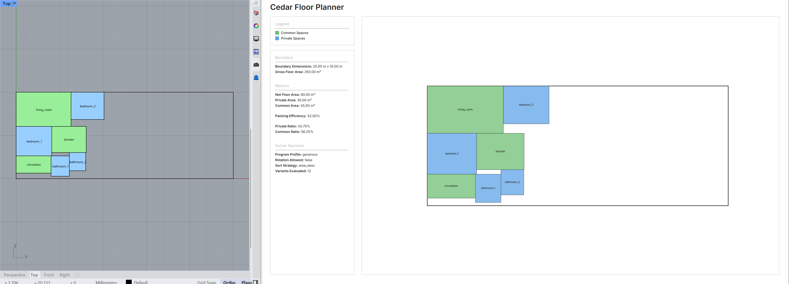

# Cedar Floor Planner Challenge

This project implements a computational floor planning system that packs a program of rooms into a rectangular boundary.
It reads a room program from CSV, generates multiple packing variants, selects the best layout based on spatial efficiency, exports the result to JSON, and visualizes the layout in a web dashboard.

The workflow integrates **Rhino + Grasshopper + Python + Web visualization**, reflecting the type of geometry-driven systems used in housing design workflows.

---

# System Overview

The pipeline follows four main stages:

```
CSV Program
   ↓
Python Packing Engine
   ↓
Layout JSON Export
   ↓
Web Dashboard Visualization
```

The boundary is defined in **Rhino**, and the packing engine computes the layout dynamically whenever the boundary changes.

---

## Quick Preview

1. Open `web/index.html`
2. The viewer loads a sample layout (`demo_layout.json`)
3. To generate a new layout, run the solver in **Rhino + Grasshopper**

---

## Example Layout



---

## Key Features

- CSV-driven room program
- Rectangle packing solver using **rectpack**
- Multi-variant layout evaluation
- Program profiles (compact, balanced, generous)
- Automatic area metrics
- JSON-based layout schema
- Interactive web dashboard
- Rhino + Grasshopper integration

---

# Detailed Features

### Room Packing Engine

Rooms are packed inside a rectangular boundary using a **rectangle bin packing algorithm**.

The system evaluates multiple solver variants and selects the most efficient layout.

Variants include:

* Rotation enabled / disabled
* Sorting strategies for packing order
* Multiple program sizing profiles

---

### Program Profiles

Rooms can vary between their **minimum area and target area** defined in the CSV.

Three program presets are tested:

* **Compact** — rooms closer to minimum area
* **Balanced** — mid-range sizing
* **Generous** — rooms closer to target area

This allows the solver to evaluate different spatial densities.

---

### Multi-Variant Solver

The system evaluates multiple packing strategies:

```
3 program profiles
×
4 packing strategies
=
12 layout variants
```

Each variant is evaluated using **packing efficiency**, and the best-performing layout is exported.

Solver metadata is included in the JSON output for transparency.

---

### Area Metrics

The system computes spatial metrics derived from geometry:

| Metric             | Description                           |
| ------------------ | ------------------------------------- |
| Gross Floor Area   | Boundary width × height               |
| Net Floor Area     | Sum of room areas                     |
| Private Area       | Sum of rooms where category = private |
| Common Area        | Sum of rooms where category = common  |
| Packing Efficiency | Net area ÷ Gross area                 |
| Private Ratio      | Private area ÷ Net area               |
| Common Ratio       | Common area ÷ Net area                |

These metrics are exported to JSON and displayed in the dashboard.

---

# Project Architecture

The project follows a modular architecture separating **models, services, and interfaces**.

```
cedar-floor-planner

data/
   room_program.csv

exports/
   layout.json (generated)

gh/
   main.py

   models/
       room.py
       boundary.py
       layout.py

   services/
       csv_loader.py
       packing_engine.py
       exporter.py

grasshopper/
   cedar_floor_planner.gh

web/
   index.html
   style.css
   app.js

README.md
schema.md
requirements.txt
.gitignore
```

---

# Core Components

### Models

```
Room
Boundary
Layout
```

These represent the geometric and programmatic entities in the system.

---

### Services

Services implement the main system logic.

```
csv_loader.py
```

Reads the room program from CSV.

```
packing_engine.py
```

Runs the packing algorithm using **rectpack**.

```
exporter.py
```

Converts the layout into a structured JSON format.

---

### Grasshopper Integration

Grasshopper acts as the **geometry interface**.

1. User draws a rectangular boundary in Rhino.
2. GH extracts boundary dimensions.
3. Python solver packs rooms inside the boundary.
4. Layout is exported as JSON.
5. The web viewer updates automatically.

---

### Web Dashboard

The web interface reads the exported JSON and renders:

* floor plan layout
* room labels
* color-coded program types
* spatial metrics
* solver decisions

The dashboard is **fully driven by the JSON output**.

---

# Technologies Used

| Tool                   | Purpose                            |
| ---------------------- | ---------------------------------- |
| Rhino 8                | Boundary geometry                  |
| Grasshopper + GhPython | Solver interface                   |
| Python                 | Packing engine and data processing |
| rectpack               | Rectangle packing algorithm        |
| JavaScript             | Layout visualization               |
| Git                    | Version control                    |

---

# How to Run

## 1. Install Python Dependencies

Install the required Python package inside Rhino's Python environment:

```bash
pip install -r requirements.txt
```

The project currently requires:

- rectpack (rectangle packing library)

---

### 2. Launch Rhino + Grasshopper

1. Open Rhino
2. Load the Grasshopper definition
3. Draw a rectangular boundary

---

### 3. Run Solver

Grasshopper executes the Python solver which:

1. Reads `room_program.csv`
2. Packs the rooms
3. Computes metrics
4. Exports `layout.json`

---

### 4. Launch Web Dashboard

Open:

```
web/index.html
```

The dashboard reads the exported JSON and visualizes the layout.

---

# Design Decisions

### Rectangular Room Model

Rooms are modeled as axis-aligned rectangles to simplify packing and ensure efficient computation.

---

### JSON-Driven Visualization

The web viewer reconstructs the layout directly from JSON.
This ensures the visualization layer remains completely decoupled from the solver.

---

### Multi-Variant Solver

Evaluating multiple packing strategies improves layout robustness and demonstrates solver exploration rather than a single deterministic output.

---

# Possible Extensions

Future improvements could include:

* adjacency constraints between rooms
* corridor generation
* irregular boundary support
* multi-floor stacking
* 3D visualization

---

# AI-Assisted Development

AI tools were used to assist with code iteration, debugging, and architectural exploration during development.
All final code and design decisions were reviewed and refined manually.

---

# Author

Vaibhav Jain
